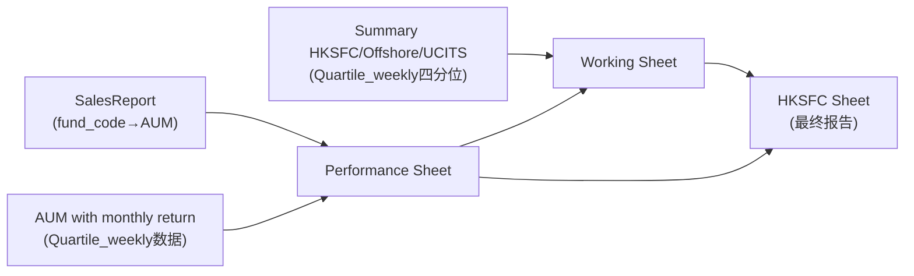

# LC Report 生成逻辑分析与修复方案

## 一、核心问题诊断

> [!CAUTION]
> 当前代码的 **根本问题**：`generate_report` 的 Step2 通过 `v_fund_period_returns` 视图从 `lc_report_fa_performance`（FundAnalysis）读取收益数据，但用户明确要求 **FundAnalysis 不参与报告生成计算**。

### 1.1 Excel 数据流（正确逻辑）

从 Excel 公式分析，数据流如下：



**关键发现**：

| Excel Sheet | 数据来源 | 对应 DB 表 |
|---|---|---|
| `SalesReport` | 上传的 SalesRptByProduct 文件 | `lc_report_sales_flow` |
| `AUM with monthly return` | 上传的 Quartile_weekly 文件 | `lc_report_qw_performance` |
| `Summary HKSFC/Offshore/UCITS` | 上传的 Quartile_weekly 文件 | `lc_report_qw_performance` (四分位) |
| `HKSFC funds/Offshore funds/UCITS funds` | 配置/元数据 | `lc_fund_code_map` + 配置 |
| `Performance` | **计算得出**（中间表） | `lc_fund_performance` |
| `Working Sheet` | **计算得出**（中间表） | `v_working_sheet` 视图 |
| `HKSFC` | **最终报告**（输出） | `lc_fund_performance_rating` 等 |

### 1.2 Performance Sheet 公式解析

Performance Sheet R4（以 VPHY 为例）的核心公式：

```
AUM:        E4 = VLOOKUP(B4, SalesReport!$B$5:$D$61, 3, 0)          -- 来自 SalesReport
AUM占比:    F4 = E4 / $E$25                                         -- E25 = SalesReport!D62 (Total VP AUM)

YTD Fund:   G4 = VLOOKUP(B4, 'AUM with monthly return'!A:K, 11, 0) / 100
YTD BM:     H4 = VLOOKUP(D29, 'AUM with monthly return'!B:K, 10, 0) / 100  -- ⚠ D29 = benchmark名称!
YTD Excess: I4 = G4 - H4

1Y Fund:    J4 = VLOOKUP(B4, 'AUM with monthly return'!A:M, 13, 0) / 100
1Y BM:      K4 = VLOOKUP(D29, 'AUM with monthly return'!B:M, 12, 0) / 100
...以此类推...

Since Inc Fund: Y4 = VLOOKUP(B4, 'AUM with monthly return'!A:AB, 28, 0) / 100
Since Inc BM:   Z4 = VLOOKUP(D29, 'AUM with monthly return'!B:AB, 27, 0) / 100
```

> [!IMPORTANT]
> **Benchmark 数据来源**：Performance Sheet 的 Benchmark 列（D列）是**硬编码**在 Excel 中的！ 
> 例如：`D4 = "MSCI AC Asia Ex Japan NR USD*"`, `D5 = "MSCI Golden Dragon NR USD*"`
> 
> Fund 收益用 **fund_code**（A列=B4）在 'AUM with monthly return' 中查找。
> Benchmark 收益用 **benchmark名称**（D列值）在 'AUM with monthly return' 中查找。
> 
> **这意味着 benchmark 名称需要配置在 `lc_fund_code_map` 表中，而不是从 FundAnalysis 自动获取。**

### 1.3 当前代码问题清单

| # | 问题 | 影响 | 严重度 |
|---|---|---|---|
| 1 | Step2 SQL 从 `v_fund_period_returns` 读取收益，该视图基于 `lc_report_fa_performance`（FundAnalysis） | 无 FundAnalysis 数据时，所有收益字段为 NULL | 🔴 致命 |
| 2 | Benchmark 名称从 `lc_report_qw_entity.benchmark` 获取，但用户要求在 `lc_fund_code_map` 配置 | benchmark 关联可能失败 | 🟡 中等 |
| 3 | Step5/6/7 依赖 `v_working_sheet` 视图，该视图又依赖 `lc_fund_performance`（Step2输出），如果 Step2 产出空数据则全链路空 | 所有下游报告为空 | 🔴 致命 |
| 4 | `v_fund_period_returns` 中 BM 匹配用 `entity_name = b.benchmark`，但 benchmark 在 QW 数据中是 Morningstar 长名，不是 Excel D列的短名 | BM 收益无法匹配 | 🔴 致命 |
| 5 | `_SQL_STEP8_OTHERS` 中 Others 计算用 `report_date` 匹配 `sales_flow`，应改用 `report_id` | 跨日期数据可能混淆 | 🟡 中等 |

---

## 二、正确的计算逻辑（基于 Excel 公式）

### Step 2: 填充 `lc_fund_performance`

**数据源**：`lc_report_sales_flow`（AUM） + `lc_report_qw_performance`（收益） + `lc_fund_code_map`（映射+benchmark配置）

**正确逻辑**：

```sql
-- 驱动表: sales_flow (fund_code, fund_name, AUM)
-- 映射: lc_fund_code_map (fund_code → entity_name, benchmark_name)
-- 收益: lc_report_qw_performance (entity_name → 各周期收益)
-- Benchmark收益: lc_report_qw_performance (benchmark_name → 各周期收益)

WITH base AS (
    SELECT
        s.fund_code,
        s.fund_name,
        fcm.entity_name,
        fcm.benchmark_name,     -- ⬅ 新字段：来自 lc_fund_code_map
        s.est_aum_usd_m AS aum_usd_mn,
        s.est_aum_usd_m / NULLIF(SUM(s.est_aum_usd_m) OVER (), 0) AS aum_vp_pct,
        fcm.inception_date
    FROM lc_report_sales_flow s
    LEFT JOIN lc_fund_code_map fcm ON fcm.fund_code = s.fund_code
    WHERE s.report_id = :rid
),
-- Fund 收益：从 QW performance 中按 entity_name 查找
fund_ret AS (
    SELECT
        e.entity_name,
        MAX(CASE WHEN p.period_type='YTD' AND p.metric='return_cum' THEN p.value END) AS ret_ytd,
        MAX(CASE WHEN p.period_type IN ('1y','1Y') AND p.metric='return_cum' THEN p.value END) AS ret_1y,
        MAX(CASE WHEN p.period_type IN ('3y','3Y') AND p.metric='return_ann' THEN p.value END) AS ret_3y_ann,
        MAX(CASE WHEN p.period_type IN ('5y','5Y') AND p.metric='return_ann' THEN p.value END) AS ret_5y_ann,
        MAX(CASE WHEN p.period_type IN ('10y','10Y') AND p.metric='return_ann' THEN p.value END) AS ret_10y_ann,
        MAX(CASE WHEN p.period_type IN ('20y','20Y') AND p.metric='return_ann' THEN p.value END) AS ret_20y_ann,
        MAX(CASE WHEN p.period_type IN ('Since Inception','SI','since_inception')
                 AND p.metric IN ('return_ann','return_cum') THEN p.value END) AS ret_si
    FROM lc_report_qw_performance p
    JOIN lc_report_qw_entity e ON e.entity_id = p.entity_id
    WHERE p.report_id = :rid
      AND e.isin IS NOT NULL AND e.isin != ''   -- Fund行（非Benchmark行）
    GROUP BY e.entity_name
),
-- Benchmark 收益：从 QW performance 中按 benchmark entity_name 查找
-- (Benchmark 行在 QW 中是 entity_name 以 "Benchmark:" 或直接就是 benchmark 名字的行，isin 为空)
bm_ret AS (
    SELECT
        e.entity_name,
        MAX(CASE WHEN p.period_type='YTD' AND p.metric='return_cum' THEN p.value END) AS ret_ytd,
        MAX(CASE WHEN p.period_type IN ('1y','1Y') AND p.metric='return_cum' THEN p.value END) AS ret_1y,
        MAX(CASE WHEN p.period_type IN ('3y','3Y') AND p.metric='return_ann' THEN p.value END) AS ret_3y_ann,
        MAX(CASE WHEN p.period_type IN ('5y','5Y') AND p.metric='return_ann' THEN p.value END) AS ret_5y_ann,
        MAX(CASE WHEN p.period_type IN ('10y','10Y') AND p.metric='return_ann' THEN p.value END) AS ret_10y_ann,
        MAX(CASE WHEN p.period_type IN ('20y','20Y') AND p.metric='return_ann' THEN p.value END) AS ret_20y_ann,
        MAX(CASE WHEN p.period_type IN ('Since Inception','SI','since_inception')
                 AND p.metric IN ('return_ann','return_cum') THEN p.value END) AS ret_si
    FROM lc_report_qw_performance p
    JOIN lc_report_qw_entity e ON e.entity_id = p.entity_id
    WHERE p.report_id = :rid
      AND (e.isin IS NULL OR e.isin = '')   -- Benchmark行
    GROUP BY e.entity_name
)
SELECT
    b.fund_code, b.fund_name, b.benchmark_name, b.aum_usd_mn, b.aum_vp_pct,
    f.ret_ytd / :div,    bm.ret_ytd / :div,    (f.ret_ytd - bm.ret_ytd) / :div,
    f.ret_1y / :div,     bm.ret_1y / :div,     (f.ret_1y - bm.ret_1y) / :div,
    ...
FROM base b
LEFT JOIN fund_ret f ON f.entity_name = b.entity_name
LEFT JOIN bm_ret bm ON bm.entity_name = b.benchmark_name   -- ⬅ 用配置的 benchmark_name 匹配
```

> [!NOTE]
> QW 数据中 `value` 的单位是百分比形式（如 8.3 = 8.3%），所以需要 `/100` 转换为小数（0.083）。
> Excel 公式中明确有 `/100`：`VLOOKUP(B4,'AUM with monthly return'!A:K,11,0)/100`

### Step 5-8: 无需修改

Step 5-8 的逻辑依赖 `v_working_sheet` 视图，只要 Step2 正确产出数据，下游自然正确。但 `v_working_sheet` 视图中的四分位数据需改为从 `lc_report_qw_performance` 直接读取（已正确）。

`v_fund_quartiles` 视图和 `v_working_sheet` 视图目前逻辑正确，无需修改。

---

## 三、`lc_fund_code_map` 表改造

### 3.1 新增 `benchmark_name` 字段

```sql
ALTER TABLE lc_fund_code_map 
ADD COLUMN benchmark_name VARCHAR(255) NULL COMMENT 'Performance Sheet D列的 benchmark 名称（用于 VLOOKUP benchmark 收益）'
AFTER inception_date;
```

### 3.2 `v_fund_period_returns` 视图改造

需要将视图从基于 `lc_report_fa_performance` 改为基于 `lc_report_qw_performance`：

```sql
CREATE OR REPLACE VIEW v_fund_period_returns AS
SELECT
    r.report_date AS as_of_date,
    p.report_id,
    e.entity_name,
    e.isin,
    CASE WHEN e.isin = '' OR e.isin IS NULL THEN 'bm' ELSE 'fund' END AS metric_kind,
    MAX(CASE WHEN p.period_type IN ('YTD')
             AND p.metric IN ('return_cumulative','return_cum')     THEN p.value END) AS ret_ytd,
    MAX(CASE WHEN p.period_type IN ('1y','1Y')
             AND p.metric IN ('return_cumulative','return_cum')     THEN p.value END) AS ret_1y,
    MAX(CASE WHEN p.period_type IN ('3y','3Y')
             AND p.metric IN ('return_ann')                         THEN p.value END) AS ret_3y_ann,
    MAX(CASE WHEN p.period_type IN ('5y','5Y')
             AND p.metric IN ('return_ann')                         THEN p.value END) AS ret_5y_ann,
    MAX(CASE WHEN p.period_type IN ('10y','10Y')
             AND p.metric IN ('return_ann')                         THEN p.value END) AS ret_10y_ann,
    MAX(CASE WHEN p.period_type IN ('20y','20Y')
             AND p.metric IN ('return_ann')                         THEN p.value END) AS ret_20y_ann,
    MAX(CASE WHEN p.period_type IN ('Since Inception','SI','since_inception')
             AND p.metric IN ('return_ann','return_cumulative','return_cum') THEN p.value END) AS ret_since_inc
FROM lc_report_qw_performance p
JOIN lc_report_qw_entity e ON e.entity_id = p.entity_id
JOIN lc_report r ON r.report_id = p.report_id
GROUP BY r.report_date, p.report_id, e.entity_name, e.isin;
```

---

## 四、Benchmark 数据配置

### 4.1 来源分析

从 Excel Performance Sheet D列提取的 Benchmark 名称：

| fund_code | fund_name | benchmark_name (Excel D列) |
|---|---|---|
| VPHY | High-Dividend Stocks Fund | MSCI AC Asia Ex Japan NR USD* |
| VPAF | Classic Fund | MSCI Golden Dragon NR USD* |
| VAIF | Value Partners Asian Income Fund | 50%MSCI AC Asia ex Jap + 50% JPM Asia Credit Index |
| VPGB | Greater China High Yield | No benchmark |
| VPMM | Value Partners USD Money Market Fund | US 90 Days Ave SOFR |
| VPMF | Chinese Mainland Focus Fund | VPMF_MSCI China_NR_Factsheet |
| VACB | VP All China Bond Fund | No benchmark |
| VPCA | China Convergence Fund | VPCA_MSCI China_NR_Factsheet |
| VATB | Value Partners Asian Total Return Bond Fund | No benchmark |
| CG | Greenchip | MSCI Golden Dragon NR USD |
| VPTF | VP Taiwan Fund | Taiwan Weighted Index TR Daily |
| VAIO | VP Asian Innovation Opportunities Fund | VAIO Custom Benchmark |
| VPJR | Value Partners Japan REIT Fund | TSE REIT NR JPY |
| VHCF | Value Partners Health care Fund | MSCI China All Shares HC 10/40 NR USD |
| VCAS | China A-Share Select Fund | CSI 300 TR CNY |
| VPMA | Multi Asset Fund | No benchmark |
| VPEJ | VP Asia Ex-Japan Equity Fund | MSCI AC Asia Ex Japan NR USD |
| VUHD | VP China A Shares High Dividend Fund | CSI 300 TR CNY (VUHD) |
| MTIA | Minsheng Tonghui IA | Hang Seng Index TR |
| VUGB | ICAV VP Greater China High Yield | No benchmark |

> [!IMPORTANT]
> **"No benchmark"** 表示该基金没有 benchmark，vs_bmk 应显示 "No BMK"。
> 这些 benchmark 名称需要与 Quartile_weekly 数据中 Benchmark 行的 `entity_name` 精确匹配。

---

## 五、DML 初始化脚本

### 5.1 `lc_fund_code_map` 初始化

```sql
-- =============================================================
-- lc_fund_code_map 初始化数据
-- benchmark_name 字段需先通过 ALTER TABLE 添加
-- =============================================================

-- 先添加 benchmark_name 字段（如尚未添加）
ALTER TABLE lc_fund_code_map 
ADD COLUMN IF NOT EXISTS benchmark_name VARCHAR(255) NULL 
COMMENT 'Benchmark名称（对应QW数据中Benchmark行的entity_name，用于匹配benchmark收益）'
AFTER inception_date;

-- 插入/更新基金映射及 benchmark 配置
INSERT INTO lc_fund_code_map (fund_code, entity_name, isin, inception_date, benchmark_name) VALUES
('VPHY', 'Value Partners High-Dividend Stocks Fund',  '', '2002-09-03', 'MSCI AC Asia Ex Japan NR USD'),
('VPAF', 'Value Partners Classic Fund',               '', '1993-04-02', 'MSCI Golden Dragon NR USD'),
('VAIF', 'Value Partners Asian Income Fund',           '', '2017-11-13', '50%MSCI AC Asia ex Jap + 50% JPM Asia Credit Index'),
('VPGB', 'Value Partners Greater China High Yield',    '', '2012-03-28', NULL),
('VPMM', 'Value Partners USD Money Market Fund',       '', '2023-08-19', 'US 90 Days Ave SOFR'),
('VPMF', 'Value Partners Chinese Mainland Focus Fund', '', '2003-11-27', 'VPMF_MSCI China_NR_Factsheet'),
('VACB', 'Value Partners All China Bond Fund',         '', '2021-09-07', NULL),
('VPCA', 'Value Partners China Convergence Fund',      '', '2000-07-14', 'VPCA_MSCI China_NR_Factsheet'),
('VATB', 'Value Partners Asian Total Return Bond Fund', '', '2018-04-09', NULL),
('CG',   'Value Partners Greenchip Fund',              '', '2002-04-09', 'MSCI Golden Dragon NR USD'),
('VPTF', 'Value Partners Taiwan Fund',                 '', '2008-03-04', 'Taiwan Weighted Index TR Daily'),
('VAIO', 'VP Asian Innovation Opportunities Fund',     '', '2019-02-26', 'VAIO Custom Benchmark'),
('VPJR', 'Value Partners Japan REIT Fund',             '', '2024-04-23', 'TSE REIT NR JPY'),
('VHCF', 'Value Partners Health Care Fund',            '', '2015-04-02', 'MSCI China All Shares HC 10/40 NR USD'),
('VCAS', 'Value Partners China A-Share Select Fund',   '', '2014-10-17', 'CSI 300 TR CNY'),
('VPMA', 'Value Partners Multi Asset Fund',            '', '2015-10-14', NULL),
('VPEJ', 'VP Asia Ex-Japan Equity Fund',               '', '2018-09-01', 'MSCI AC Asia Ex Japan NR USD'),
('VUHD', 'VP China A Shares High Dividend Fund',       '', '2020-10-19', 'CSI 300 TR CNY'),
('MTIA', 'Minsheng Tonghui IA',                        '', '2017-01-23', 'Hang Seng Index TR'),
('VUGB', 'ICAV VP Greater China High Yield',           '', '2019-12-06', NULL)
ON DUPLICATE KEY UPDATE
    entity_name    = VALUES(entity_name),
    inception_date = COALESCE(VALUES(inception_date), inception_date),
    benchmark_name = VALUES(benchmark_name),
    updated_at     = NOW();
```

> [!WARNING]
> `entity_name` 和 `isin` 字段的实际值需要根据上传的 Quartile_weekly 文件中的实际 entity 名称来校准。
> 上面的 `entity_name` 是根据 Excel 中的 Fund Name 填写的占位值，ETL 上传时会自动覆盖为 Morningstar 长名。
> `benchmark_name` 必须与 QW 数据中 Benchmark 行的 `entity_name` 完全一致。

### 5.2 `lc_other_accounts_config` 初始化

```sql
-- =============================================================
-- lc_other_accounts_config 初始化数据
-- 对应 HKSFC Sheet R42-R44 的 Others 区域
-- =============================================================

INSERT INTO lc_other_accounts_config (account_name, fund_code, display_order) VALUES
('Gold ETF',    'VPGE',  1),    -- fund_name = "Value Gold ETF"
('Real Estate', 'VPRE',  2)     -- fund_name = "Asia Pacific Real Estate LP"
ON DUPLICATE KEY UPDATE
    fund_code     = VALUES(fund_code),
    display_order = VALUES(display_order);
```

> [!NOTE]
> Excel 中 Gold ETF 的查找公式是 `VLOOKUP("Value Gold ETF", SalesReport!C:O, 2, 0)`，
> 即按 fund_name 查找 AUM。在我们的系统中改为按 fund_code 匹配。
> 需要确认 `VPGE` 和 `VPRE` 是否是正确的 fund_code。

### 5.3 HKSFC 报告中 "Others 2" 的计算

```
Others 2 AUM = Total VP AUM - Performance基金AUM合计 - Gold ETF AUM - Real Estate AUM
```

对应 Excel 公式：`D44 = Performance!$E$25 - SUM(D23, D39, D42, D43)`

其中：
- `Performance!$E$25` = Total VP's AUM = `SalesReport!D62` = 所有基金 AUM 之和
- `D23` = 上方表格（>100mil）AUM 合计
- `D39` = 下方表格（15-100mil）AUM 合计  
- `D42` = Gold ETF AUM
- `D43` = Real Estate AUM

---

## 六、`DIVIDE_100` 系数确认

从 Excel 公式可以看到：
```
G4 = VLOOKUP(B4, 'AUM with monthly return'!A:K, 11, 0) / 100
```

这意味着 Quartile_weekly（'AUM with monthly return'）中的收益值是**百分比形式**（如 8.3 表示 8.3%），需要除以 100 转换为小数。

**因此 `DIVIDE_100` 应设为 `100`**，而非当前的 `1`。

> [!CAUTION]
> 但这取决于 ETL 写入 `lc_report_qw_performance.value` 时的单位。
> 如果 ETL 已经将百分比转为小数（0.083），则 `DIVIDE_100 = 1`。
> 如果 ETL 存储的是原始百分比（8.3），则 `DIVIDE_100 = 100`。
> **需要查看实际数据确认。**

---

## 七、修改总结

### 需要修改的文件

| 文件 | 修改内容 |
|---|---|
| [02_report_generator_views.sql](file:///d:/DingChi/git/huili_demo/backend/ddl/LCReport/02_report_generator_views.sql) | `v_fund_period_returns` 改为基于 `lc_report_qw_performance`；`lc_fund_code_map` 加 `benchmark_name` |
| [lcReportGeneratorService.py](file:///d:/DingChi/git/huili_demo/backend/service/lcReportGeneratorService.py) | Step2 SQL 改为从 QW 读取收益；benchmark 从 `lc_fund_code_map.benchmark_name` 获取 |
| [loader.py](file:///d:/DingChi/git/huili_demo/backend/utils/lcReport/loader.py) | `_upsert_fund_code_map` 保留 benchmark_name 不被覆盖 |

### 需要执行的 DDL/DML

1. `ALTER TABLE lc_fund_code_map ADD COLUMN benchmark_name ...`
2. `INSERT INTO lc_fund_code_map ...`（上面的 DML）
3. `INSERT INTO lc_other_accounts_config ...`（上面的 DML）
4. `CREATE OR REPLACE VIEW v_fund_period_returns ...`（改为基于 QW）

### 不需要修改的部分

- Step 5-8 的 SQL 逻辑本身正确，只要 Step2 产出正确数据
- `v_fund_quartiles` 和 `v_working_sheet` 视图逻辑正确
- ETL 解析逻辑（pipeline/loader）无需修改
